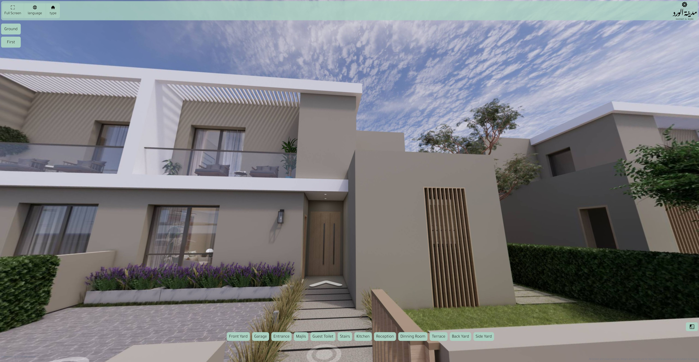

# Alward

A Real Estate web project



## Features 
  - Responsive layout and UI components
  - Interactive elements (buttons, forms, modals) where applicable
  - Light/dark mode for client-side  interactivity
  - dual language Arabic-English

## Technology Stack
- React, Tailwind, NodeJs, Express

## Installation / Run Locally
**If this is a static HTML/CSS/JS project (open in browser):**
```
# Clone the repo
git clone https://github.com/BahaaAhmed1990/alward
# Open index.html in your browser
```

**If this is a React project:**
```bash
git clone https://github.com/BahaaAhmed1990/alward
cd alward
npm install
npm start
# or
yarn
yarn start
```

## Project Link
- Link: https://alward-production.up.railway.app/


## Contributing
Contributions are welcome. Please open an issue or submit a pull request with clear description of changes.

## License
This project is available under the [MIT License](LICENSE) — or specify your project license.

## Contact
- Email: bahaaahmed19902012@gmail.com
- GitHub: github.com/BahaaAhmed1990
- LinkedIn: linkedin.com/in/eng-bahaaahmed
- WhatsApp: +20 128 854 6544
